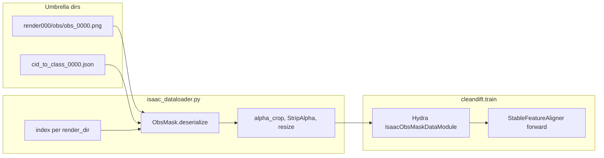

## Keywords / Tags
- cleandift
- training-pipeline
- isaac-datagen
- obsmask
- dataset-adapter
- serialize-deserialize
- vision-core
- uv-package
- hydra
- plan-completed
- finetune

# Isaac ObsMask training adapter + uv package — COMPLETE (2026-06-23)

Fine-tune CleanDIFT on isaac_datagen render umbrellas without exporting jpg+json.
Reads on-disk `ObsMask` samples via `vision_core` serialize/deserialize; ships as a
uv-managed fork at `jeffrey-ke/cleandift`.

Related: [`docs/paper-code-map.md`](../../../docs/paper-code-map.md) (paper ↔ code audit).

---

## What shipped

| Piece | Location |
|-------|----------|
| uv package (`cleandift` import, `.venv`, `uv.lock`) | `pyproject.toml`, `src/cleandift/` |
| Train entry point | `cleandift-train` → `cleandift.train:main` |
| Isaac dataset adapter | `src/cleandift/isaac_dataloader.py` |
| COYO-style loader (unchanged path) | `src/cleandift/dataloader.py` (`DummyDataset`) |
| Single-umbrella Hydra config | `configs/sd21_isaac_obsmask.yaml` |
| Multi-umbrella Hydra config | `configs/sd21_isaac_obsmask_multi.yaml` |
| Fork | https://github.com/jeffrey-ke/cleandift |

---

## Setup

Requires Python **3.11+** and a GPU driver compatible with **cu128** (torch is pinned to the cu128 index, not cu130).

```bash
git clone git@github.com:jeffrey-ke/cleandift.git
cd cleandift
uv sync
```

`uv sync` automatically installs:
- **torch/torchvision** from `https://download.pytorch.org/whl/cu128`
- **vision-core** from git at pinned rev `4b266353` (`jeffrey-ke/vision_core`) — see `[tool.uv.sources]` in `pyproject.toml`

Verify CUDA:

```bash
uv run python -c "import torch; print(torch.__version__, torch.cuda.is_available())"
# expect: 2.x+cu128 True
```

---

## Dataset adapter design

### Contract with upstream `train.py`

Hydra instantiates `cfg.data`; the training loop calls `model(**batch)` where batch is:

```python
{"x": FloatTensor (B, 3, H, W) in [-1, 1], "caption": list[str]}
```

Same keys as `DummyDataset` — **no changes to `train.py` or `StableFeatureAligner`**.

### On-disk format (isaac_datagen)

Each **umbrella directory** holds self-contained `render{idx:03d}/` subdirs:

| Read | API |
|------|-----|
| Per frame | `ObsMask.deserialize(frame_idx, render_dir)` |
| Per render dir (idx 0) | `ObsMaskDescriptorMetadata.deserialize(0, render_dir)` |
| Frame count | `count_samples(render_dir, field="obs")` |
| Discovery | `render*/` with an `obs/` subdir |

Optflow umbrellas (`shelf-optflow`, `mixed-persp`) nest `ObsMask` flat — the same `obs/` files work.

**No jpg+json export.** The adapter is read-through, matching `OptFlow2UFM` in UFM-train and `viz_clusters.py`.

### Classes

- **`IsaacObsMaskDataset`** — one umbrella; flat index `[(render_dir, frame), …]`
- **`make_isaac_obsmask_dataset`** — factory; `dataset_dirs=[…]` builds one dataset per umbrella and **`ConcatDataset`**s them
- **`IsaacObsMaskDataModule`** — Hydra target; exposes `train_dataloader()` / `val_dataloader()`

### Per-sample pipeline

1. `ObsMask.deserialize(f, rd)`
2. Optional **`alpha_crop`** on RGBA (strip transparent letterboxing)
3. **`StripAlpha()`** → RGB float `[0, 1]`
4. Bilinear resize to **`img_size`** (768 for SD2.1 config)
5. Normalize **`x = rgb * 2 - 1`**
6. **Caption** from `caption_mode`:
   - `empty` → `""` (pair with `use_text_condition: false`)
   - `classes` → visible class names from `cid_mask` + `cid_to_class`

### Config knobs (`IsaacObsMaskDataModule`)

| Key | Purpose |
|-----|---------|
| `dataset_dir` | Single umbrella parent (mutually exclusive with `dataset_dirs`) |
| `dataset_dirs` | List of umbrella paths → concatenated training pool |
| `render_dirs` | Restrict to named renders under one umbrella |
| `val_render_dirs` | Hold out renders for val (**single `dataset_dir` only**) |
| `alpha_crop` | Crop to non-transparent bbox before resize (default `true`) |
| `caption_mode` | `empty` \| `classes` |
| `img_size` | Square resize target (768 for SD2.1) |
| `batch_size` | DataLoader batch size |

---

## How to run training

### COYO-style (upstream default)

Flat `./data` with `filename.jpg` + `filename.json` (`caption` key):

```bash
uv run cleandift-train --config-name sd15_feature_extractor
# or SD2.1: --config-name sd21_feature_extractor
```

### One isaac umbrella

```bash
uv run cleandift-train --config-name sd21_isaac_obsmask \
  data.dataset_dir=/data/user/jeffk/datasets/expanded-refseg \
  data.batch_size=4
```

Restrict renders:

```bash
uv run cleandift-train --config-name sd21_isaac_obsmask \
  data.dataset_dir=/path/to/debug \
  'data.render_dirs=[render996]'
```

### Multiple umbrellas (concatenated)

Pre-built config (refseg training pool, **3750 frames** as of 2026-06):

```bash
uv run cleandift-train --config-name sd21_isaac_obsmask_multi
```

| Umbrella | Frames |
|----------|--------|
| `expanded-refseg` | 2100 |
| `mixed-persp` | 750 |
| `shelf-optflow` | 900 |

Ad hoc override:

```bash
uv run cleandift-train --config-name sd21_isaac_obsmask \
  data.dataset_dir=null \
  'data.dataset_dirs=[/data/user/jeffk/datasets/expanded-refseg,/data/user/jeffk/datasets/mixed-persp]'
```

### `sd21_isaac_obsmask.yaml` training defaults

- SD2.1, `img_size: 768`, `use_text_condition: false`
- VAE repo: `sd2-community/stable-diffusion-2-1`
- `max_steps: 400`, warmup 50 steps
- Checkpoints → `./checkpoints/step_{N}.pth`

---

## Architecture (data → train loop)



---

## Verification (done)

1. **Unit:** `IsaacObsMaskDataset` on `render996` → 2 samples, `(3, 768, 768)`, caption `""`
2. **Multi:** `make_isaac_obsmask_dataset(dataset_dirs=[expanded-refseg, mixed-persp, shelf-optflow])` → len **3750**
3. **Hydra:** `sd21_isaac_obsmask_multi` instantiates `IsaacObsMaskDataModule`, batch collates correctly
4. **Git dep:** `uv sync` installs `vision-core` from pinned git rev; `ObsMaskDescriptorMetadata` imports OK
5. **CUDA:** cu128 torch reports `cuda available True` on RTX 4090 / driver 570.x

---

## Known gaps (not adapter blockers)

1. **`StableFeatureAligner` pipe repo** — UNet/text encoder still load from hardcoded `stabilityai/stable-diffusion-2-1` in `sd_feature_extraction.py`; only the VAE uses `sd2-community` in config. Full training needs that repo cached or a follow-up to plumb `repo` through the aligner.
2. **`mixed-persp` cid/iid orphans** — affects verifier labels, not CleanDIFT's self-supervised alignment loss.
3. **Paper vs config divergences** — see paper-code-map §7 (lr, warmup, FiLM vs AdaRMS, etc.).

---

## Files touched (implementation log)

- `src/cleandift/isaac_dataloader.py` — adapter + `ConcatDataset`
- `configs/sd21_isaac_obsmask.yaml`, `configs/sd21_isaac_obsmask_multi.yaml`
- `pyproject.toml` — uv package, cu128 torch index, vision-core git pin
- `src/cleandift/` — package layout (was flat `src.*` imports)
- `README.md` — uv quick start
- Remotes: `origin` → `jeffrey-ke/cleandift`, `upstream` → `CompVis/cleandift`
